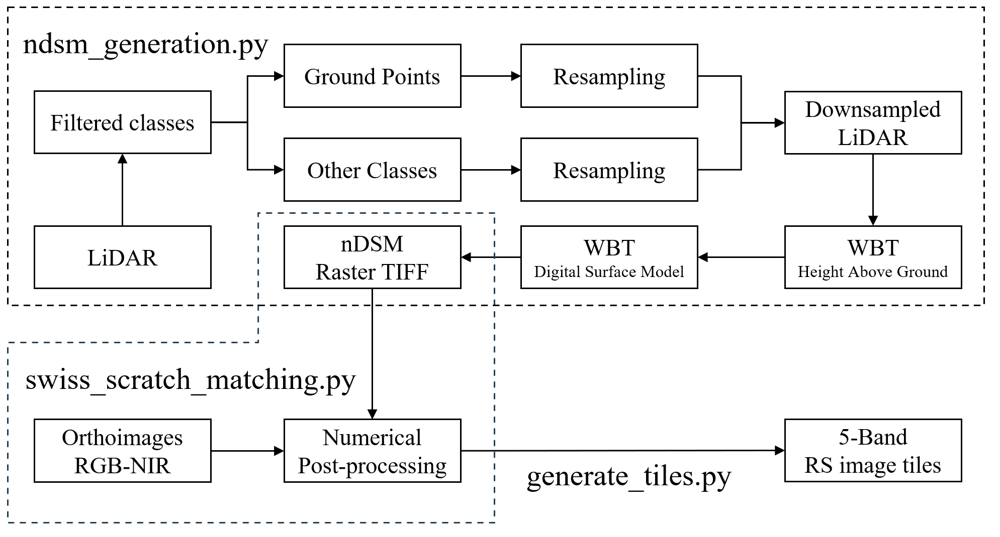

# Dataset Preparation 

The open data used to generate our large-scale remote sensing imagery dataset and their statistics are introduced in [tech website](https://tech.stdl.ch/PROJ-VIT/#dataset-construction). This README documented how to launch the scripts to run the data generation workflow shown below.

<p align="center">

<br />
<i> Workflow to generate 5-band images with classified LiDAR and orthoimages </i>
</p>

First, use the pdal official docker image to launch the container:

```
docker pull pdal/pdal
docker run -it -v /mnt/:/mnt/ --gpus all --ipc=host --privileged pdal/pdal
```

Install necessary libraries and dependencies:

```
conda activate pdal
conda install -c conda-forge gdal -y
pip install PDAL wget numpy pandas tqdm whitebox rasterio geopandas shapely scipy
```

For normalized Digital Surface Model (DSM) generation, we developed a multi-thread script to automatically process the lidar LiDAR point cloud given download links from the following resources: 
- [swissSURFACE3D - swisstopo](https://www.swisstopo.admin.ch/en/height-model-swisssurface3d) 
- [LIDAR HD - IGN, France](https://geoservices.ign.fr/lidarhd#telechargementclassifiees)

This script should be compatible with LiDAR resources in `las` or `copc.laz` format. For compressed data, e.g., `las.zip`, customized modification of the code is needed to ensure the file name consistency. To run the script, please export all the download links in `csv` format, the resolution of nDSM Tiff and the number of processes (depending on the CPU cores of your machine) can be set through the argument:

```
python ndsm_generation.py --csv_dir ${PATH_TO_CSV} --out_dir ${SAVE_PATH} --nproc ${NUM_PROCESS} --resolution ${NDSM_RES}
```

After nDSM generation, the GeoTiff raster is matched and aggregated with the 4-band orthography that contains RGB and NIR channels. The resources for Swiss and French area can be accessed below:

- [SWISSIMAGE RS/scratch - swisstopo](https://www.swisstopo.admin.ch/fr/orthophotos-swissimage-rs)

- [BD ORTHO - IGN, France](https://geoservices.ign.fr/bdortho) 

An example script for Swiss area imagery is provided:

```
# scratch_img_folder is the path to SWISSimage scratch (4-band ortho imagery)
python swiss_scratch_matching.py --ndsm_folder ${NDSM_PATH} --scratch_img_folder ${ORTHO_PATH} --output_folder ${SAVE_PATH} --dmg_tif_ls ${FILE_LIST}
```

You can exclude the damaged tif file in `scratch_img_folder` (if exists) by argument `dmg_tif_ls`.

Finally, aggregated 5-band imagery is segmented into tiles:

```
python generate_tiles.py --input_folder ${IMG_PATH} --output_folder ${SAVE_PATH}
```

For the Italian area, only ortho imagery and DSM/DTM resources are provided. You can download the resources from the links below:  


- [Ortofoto 2022 area urbana - City of Ferrara, Italy](https://dati.comune.fe.it/dataset/ortofofo2022)
- [Modello digitale terreno (DTM) 2022](https://dati.comune.fe.it/en/dataset/dtm-2022)
- [Modello digitale delle superfici (DSM) 2022](https://dati.comune.fe.it/dataset/dsm-2022)

We provided a jupyter notebook (`italy_processing.ipynb`) to differentiate the nDSM and post-process the data. 